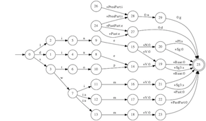

# Machine Morphology :: XFST

*Or, yet another linguistic tool they didn't tell you about in LING 101*

# XFST

* Construct finite-state machines to represent relations between morphemes and features.

* All regular expressions can be expressed as FSA → we should be able to represent most morphological-phonological phenomena.

## Installation

* Get XFST at <http://www.fsmbook.com>
* Good idea to have Python and [GraphViz][].

## Basics

Don't forget:

* All commands end with `;`
* Remember to type `{dog} | {cat}` or `d o g | c a t` (with spaces), NOT `dog|cat`

XFST uses the "stack":

* Stack
	* Last-in, first-out (LIFO): push, pop
* Variables
	* Held in memory until undefined

Dealing with them:

	{save/load} {stack/defined} filename.foo

# Exercise 1: Make graphic of FSA

Have `plg2dot.py` script. Python and GraphViz (which gives you `dot`) must be installed.

	xfst[0]: read regex ( r e )[ l o c k | c o r k ][ i n g | e d | s | 0 ] ;
	xfst[1]: print words	!see all the words generated
	xfst[1]: print net	!get description of FSA
	xfst[1]: write prolog > corked.plg	!convert to Prolog file
	xfst[1]: exit
	$ python plg2dot.py corked.plg > corked.dot
	$ dot -Tpdf corked.dot -o corked.pdf
	
# Exercise 2: How to test a transliterator

In XFST:

	read regex < port-pronun.regex
	apply down 'mydata.words'
	OR
	apply down 'mydata.words' > results.txt

**.regex** file is list of rewrite rules, in xfst-syntax. Syntax is

	[ p -> q || environment ] 

`.o.` is the composition character, you are essentially joining multiple FST together.

Example

		[ ç -> s ]			! unrestricted
	.o.	[ s -> z || vowel _ vowel ]	! intervocalically voiced
	.o.	[ l h -> L 0 ]			! palatal digraph
	.o.	[ z -> s || _ .#. ]		! word-final devoicing
	.o.	[ c -> s || _ [e|i|é|í] ]	! front vowels

**.words** file is a list of the words to be tested, each word separated by line:

	vermelho
	simpático
	...

Notice `vowel` was used in the environment for one of the rules. This searches for a file called `vowel.vars`, which is binary (not human-readable)

To make a `.vars` file (don''t forget semicolon at end of xfst commands)

	xfst[0]: define front_vowel [e|i|é|í];
	xfst[0]: save defined variables.vars	! this saves ALL defined variables to a file called variables.vars
	xfst[0]: undefine front_vowel
	xfst[0]: print net front_vowel
		s0: e -> fs1, i -> fs1, é -> fs1, í -> fs1.
	xfst[0]: load defined vowels.vars
	
# Exercise 3: Using lexc to compose morphologies

**lexc** is the companion to xfst that makes making FST much easier to visualize. Read more at the official [UPenn Documentation on Lexc][LEXC])

Here's a sample lexc lexicon:

	Multichar_Symbols +Verb +Noun +Pl +Sg +3rd +Past +Pres +Fut +Pers +Prog

	LEXICON Root
	walk V ; 
	talk V ;
	
	LEXICON V
	+Verb+Sg+3rd:s # ;
	+Verb+Past:ed # ; 

At the top we define Multichar_Symbols.

Each block is called a **(sub)lexicon**. One must have the name `Root`. 

* Heading: LEXICON {name}
* Entry: {form} {continuation class} ;

Continuation class can be another sublexicon's name or the terminator symbol `#`.

Testing the network in XFST:

	xfst[0]: read lexc < input.txt
	xfst[1]: compose net	!composites all networks on stack, top-down
	
	xfst[1]: up walks
	walk+Verb+Sg+3rd
	
Try using `print upper` and `print lower` to see the list of words.

We can re-use Exercise 1 to print a graph of this lexc network too.

	$ xfst -f lexc2plg.xfst
	[copied from above]
	$ python plg2dot.py test.plg > test.dot
	$ dot -Tpdf test.dot -o test.pdf

[LEXC]: http://www.cis.upenn.edu/~cis639/docs/lexc.html#Transducer
[GraphViz]: http://www.graphviz.org/